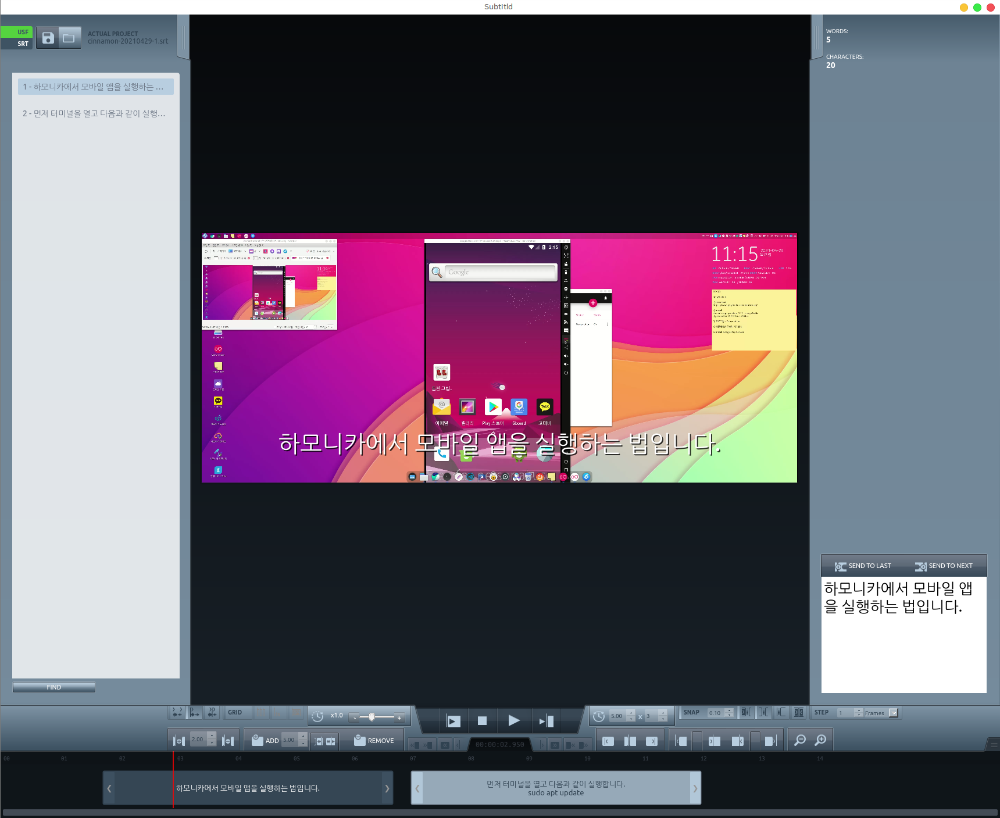

# Subtitld

영상에 자막을 추가 또는 편집하는 프로그램

 * upstream : https://gitlab.com/jonata/subtitld

An open source software to create, edit and transcribe subtitles. It is able to work with SRT, SSA, TTML, SBV, DFXP, VTT, XML, SCC and SAMI file formats.



## 프로그램 설치
아래 링크에서 제공하는 파일을 다운로드 받아서 설치합니다.

* https://subtitld.jonata.org/install

## run from source
```
git clone https://github.com/hamonikr/subtitld.git

make run
```


## Getting Started

If you need some more information on how to use the software, please visit the project website at [subtitld.jonata.org](https://subtitld.jonata.org). Here are the instructions to install Subtitld from the source. Please note that you need to follow this intructions only if you really want to run Subtitld from source. If you are not familiar with the terminal and just want to install and use it in a easy way, you are encouraged to use the Snap package (available on Ubuntu Software) on Linux distributions or the Windows Installer (available from the website).

### Prerequisites

Subtitld uses 2 main tools to work. The `ffmpeg` is used for internal processes and `libmpv` for video playback. Also, it uses PyQt5 for the GUI. Depending on your system you will need to install PyQt5 separatelly. For example, if you use a Ubuntu system, you can install this tools using `apt`:

```
sudo apt install ffmpeg libmpv1
```

Also, Subtitld is written using Python version 3. The majority of modern Linux distributions already have this version installed or at lease available. Make sure you have Python 3 on your system. Windows users will need to install it.

### Running from source

You will need to download Subtitld source code. You can download a Zip or Tar package from GitLab project page, but maybe an easier way to download the source code is using `git clone` command, like this:

```
git clone https://gitlab.com/jonata/subtitld.git
```

Considering that you have `ffmpeg` and `libmpv` installed, and Python 3 is available on your system, you can install all needed packages using `pip`.

Using the terminal, go to the subtitld folder you just downloaded or cloned and run the `pip install` command:

```
sudo python3 -m pip install -r requirements.txt
```

Now you are able to run Subtitld from source. Run the following code:

```
python3 subtitld.py
```

## Made possible mainly by

* [PyQt5](https://www.riverbankcomputing.com/software/pyqt/) - The Qt5 GUI library for Python
* [ffmpeg](https://ffmpeg.org/) - The absolute solution for media manipulation
* [libmpv](https://github.com/mpv-player/mpv) - The powerful MPV media playback engine

## Contributing

If you find a bug or want to suggest a new feature, feel free to [report an issue](https://gitlab.com/jonata/subtitld/-/issues). Also, consider [supporting the project](https://subtitld.jonata.org/support).

## License

This project is licensed under the GPL3 License - see the [LICENSE](LICENSE) file for details
